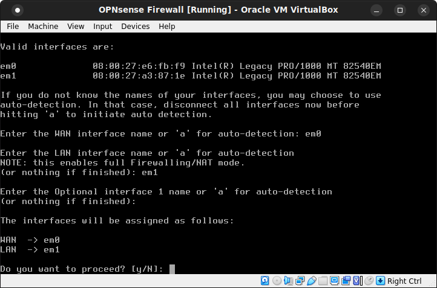
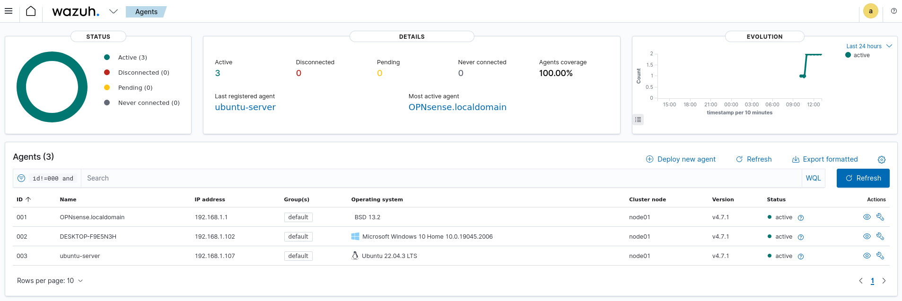
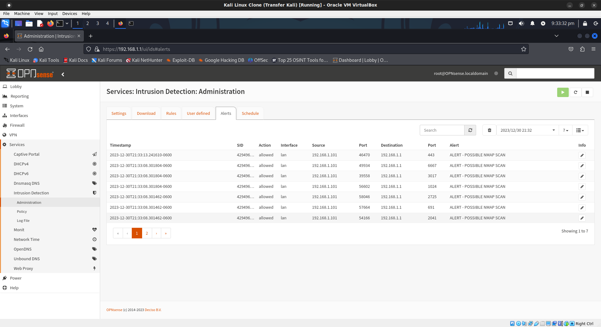
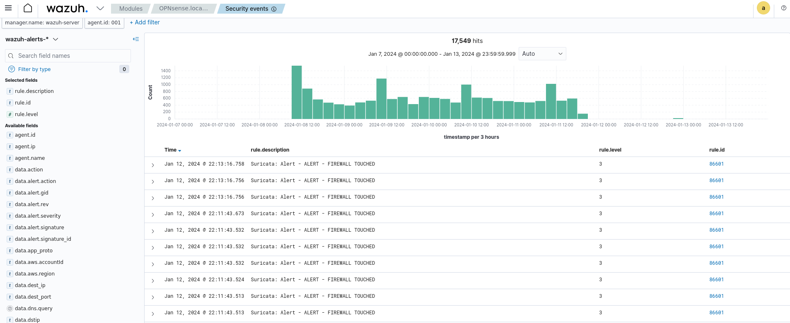

# Cybersecurity Homelab 

## Objective:
Establish a comprehensive home lab for hands-on practice in various cybersecurity domains.

Mock up a simulation of a small company with a server, office staff, and a local network for various tests and scenarios. 

## Duration: 
December 2023 - Present 

                                                 
## Software/OS Used:
- VirtualBox 
- OPNsense 23.7
- Suricata 
- Wazuh
- Kali Linux 
- Windows 10
- Ubuntu Server 22.04
- Metasploitable 
 
## Project Description: 
The Cybersecurity Home Lab project aims to create a dynamic environment for continuous learning and practical application of cybersecurity concepts. 

## Key Features: 
1. Simulated network environment with OPNsense firewall between LAN and WAN. 
2. Virtual machines running various operating systems for penetration testing and defense. 
3. Integration of IDS/IPS using Suricata and Wazuh. 
4. Simulated server and office environment sharing a local network.

**Challenges & Solutions:** Challenge: Integration of ELK Stack for log analysis. Solution: Extensive research, online tutorials, and collaboration with the community. 

## Implementation Details: 
1. Installed and configured Virtualbox.
2. Installed Kali Linux as SOC and attacker. Network on internal only
3. Installed OPNsense. Network WAN bridged adapter, LAN internal network.
4. Installed Windows 10 as office environment.
5. Installed Ubuntu Server as company server.
6. Installed Metasploitable as Out of Date / Poorly Configured / Vulnerable Server.
7. Installed Wazuh as SIEM tool and installed agents to each VM. 

## Firewall and IDS/IPS Setup
1. In kali logged in OPNsense via browser. Updated firmware, installed virtualbox and wazuh plugin.
2. Navagated to interface settings and disabled hardware CRC, TSO, and LRO interfaces per the OPN manual.
3. Navagated to services intrusion detection admin. Enabled advanced mod. Intrusion detection, IPSD, promiscuous, and enabled sylog alerts. Adjusted pattern matcher to more modern Hyperscan.
4. Set new user defined rules to alert if any scans happen to firewall, or other VMs on the LAN.
5. In Wazuh confirmed active agent status of VMs
6. In kali linux used Nmap to scan firewall to confirm user defined rules were working and logging in Wazuh and OPNsense. 

## Results & Achievements:
Successful creation of a dynamic and secure home lab environment, gaining practical experience network setup and monitoring. 

## Future Enhancements:
1. Expand the lab with additional VMs to simulate larger networks. 
2. Incorporate threat intelligence feeds for more realistic scenarios. 
3. Utilize GNS3 for Simulated network environment. 

## Future Projects:
1. Network Security Monitoring with Wazuh: perform network security monitoring on traffic between Servers and Windows 10. 
2. Firewall Configuration and Rules Testing: Use OPNsense to configure firewall rules for traffic between Servers and Windows. Test different scenarios and understand the impact of rule changes. 
3. Vulnerability Assessment and Patching: Conduct vulnerability assessments on Servers and Windows 10 using tools like OpenVAS. Implement patching strategies to address identified vulnerabilities. 
4. Secure VPN Setup: Configure OPNsense to establish a secure VPN connection between Servers and Windows. Test the VPN for confidentiality and integrity of data transmission. 
5. Penetration Testing Lab: Set up a controlled environment for penetration testing using Kali Linux in VirtualBox. Assess the security posture of Ubuntu Server, Metaspolitable, and Windows 10, identifying and patching vulnerabilities. 
6. Web Application Security Testing: Deploy a web application on Ubuntu Server and perform security testing using tools like OWASP ZAP. Evaluate the effectiveness of Wazuh in detecting web application attacks. 
7. Centralized Logging with ELK Stack: Integrate ELK Stack (Elasticsearch, Logstash, Kibana) to centralize logs from Ubuntu Server, Windows 10, and Wazuh. Create custom dashboards to visualize security events. 
8. Incident Response Simulation: Simulate a security incident on the network and use Wazuh to detect and respond to the incident. Document the incident response process and lessons learned. 
9. Implementing Security Policies: Define and implement security policies on OPNsense to control traffic between Ubuntu Server and Windows 10. Test the effectiveness of the policies in preventing unauthorized access. 
10. Honeypot Deployment: Deploy a honeypot using tools like Honeyd or Modern Honey Network (MHN). Monitor and analyze the attacks directed at the honeypot, enhancing threat intelligence. Remember to document each project thoroughly, including configurations, findings, and any improvements made. 

These projects will provide practical experience across various cybersecurity domains.

## References: 
Online tutorials and official documentation of tools used. 

## Screenshots:

  
  
  
  
   
   
   

